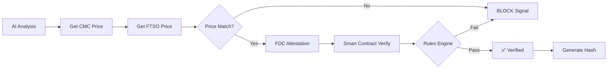

# VERIDICT - Blockchain-Verified AI Trading Analyzer

> **The First AI Trading System with On-Chain Verification** 🔐  
> Combines real-time AI analysis with Flare Network blockchain verification to ensure every trading signal is cryptographically verified and tamper-proof.

Demo Video:  https://www.loom.com/share/b8aaefd1e8654fb380e7e2461bbada2f

Deployed Link: https://veridict.netlify.app

[](https://opensource.org/licenses/MIT)
[](https://www.python.org/downloads/)
[](https://fastapi.tiangolo.com)

## 🌟 What Makes VERDICT Unique?

**Traditional AI trading tools have a trust problem:** You can't verify if the price data and recommendations are authentic or have been tampered with.

**VERIDICT solves this** by integrating blockchain verification at every step:

✅ **FTSO Price Feeds** - Decentralized oracle price data from Flare Network validators  
✅ **Smart Contract Verification** - Every trading signal is verified on-chain  
✅ **Tamper Detection** - Automatically detects and blocks manipulated data  
✅ **Cryptographic Proofs** - Each recommendation includes a verification hash  
✅ **Component Health Monitoring** - Real-time status of all verification systems  
✅ **Rules Engine** - Configurable verification rules to ensure signal quality  

## 🚀 Key Features

### 1. **AI-Powered Trading Analysis**
- 🤖 **Gemini AI Sentiment Analysis** - Advanced NLP-based market sentiment scoring
- 📊 **Real-time Market Data** - Live price, volume, and market cap from CoinMarketCap
- ⛓️ **On-Chain Analysis** - Flare blockchain activity and liquidity metrics
- 🎯 **Smart Recommendations** - LONG, SHORT, or HOLD signals with confidence scores
- ⚡ **Leverage Suggestions** - Risk-adjusted leverage recommendations (1x-20x)
- 💰 **PnL Calculations** - Projected profit/loss scenarios for perpetual trading

### 2. **Flare Network Blockchain Verification**
- 🔗 **FTSO Price Feeds** - Get verified prices from Flare's decentralized oracle
- 📝 **Smart Contract Verification** - On-chain verification of every trading signal
- 🛡️ **FDC Integration** - Flare Data Connector for cross-chain data attestation
- 🔐 **Verification Hash** - SHA-256 hash of every recommendation for audit trails
- ✅ **Price Matching** - Ensures AI price matches blockchain-verified price (±1% tolerance)

### 3. **Advanced Security & Monitoring**

#### **Component Health Monitoring**
Real-time health tracking of all verification components:
- FTSO Price Feed status
- CoinMarketCap API availability
- FDC endpoint health
- Smart contract connectivity
- Response time monitoring
- Automatic failure detection

#### **Attack Simulation**
Demonstrates the verification system's robustness:
- **Price Manipulation** - Simulates fake price data to test detection
- **Sentiment Corruption** - Tests resilience against manipulated sentiment
- **Proof Invalidation** - Verifies FDC attestation proof validation
- Real-time tamper detection and blocking

#### **Rules Engine**
Configurable verification rules with a mini DSL:
- YAML-based rule configuration
- Dynamic rule evaluation
- Critical vs. warning severity levels
- Automatic signal blocking on rule failures
- 29+ built-in verification rules

### 4. **Real-Time Updates & Streaming**
- 🔄 **Autonomous Agent Loop** - Background analysis every second
- 📡 **RESTful API** - Poll for instant recommendations
- 🌊 **WebSocket Support** - Real-time streaming updates
-  **Live Price Tracking** - Smooth price updates with adaptive variation
- 📈 **Price History** - Last 100 data points with timestamps

### 5. **Position Management**
- 📌 **Automated Position Tracking** - Track LONG/SHORT positions
- 💵 **Real-time PnL** - Live profit/loss calculations
- 🚦 **Exit Signals** - Automatic take-profit and stop-loss triggers
- ⚖️ **Risk-Based Sizing** - Position sizing based on risk level (conservative/moderate/aggressive)
- 🔄 **Multi-Session Support** - Track multiple positions simultaneously

### 6. **Python SDK & BYOK Model**
- 📦 **Official Python SDK** - `verdict-sdk` for easy integration
- 🔑 **Bring Your Own Key (BYOK)** - Use your own API keys
- 🌐 **No Backend Required** - Works with any deployed VERDICT API
- 📖 **Comprehensive Docs** - Examples, guides, and best practices
- 🔌 **Async/Await Support** - Built for modern Python applications

### 7. **Production-Ready**
- 🔧 **Environment Configuration** - `.env` file management
- 📝 **Comprehensive Logging** - Detailed logs for debugging
- 🧪 **Test Suite** - Unit tests and integration tests
- 📚 **API Documentation** - Interactive Swagger/ReDoc docs
- 🚀 **Deployment Guides** - Render, Railway, AWS, DigitalOcean

## 📋 Table of Contents

- [Quick Start](#-quick-start)
- [Installation](#-installation)
- [API Endpoints](#-api-endpoints)
- [Flare Network Verification](#-flare-network-verification-workflow)
- [Advanced Features](#-advanced-features)
- [Python SDK Usage](#-python-sdk-usage)
- [Project Structure](#-project-structure)
- [How It Works](#-how-it-works)
- [Deployment](#-deployment)
- [Risk Disclaimer](#-risk-disclaimer)

## ⚡ Quick Start

### 1. **Clone & Install**

```bash
git clone <repository-url>
cd VERIDICT
cd backend
pip install -r requirements.txt
```

### 2. **Configure Environment**

Create a `.env` file in the `backend/` directory:

```env
# Required API Keys
CMC_API_KEY=your_coinmarketcap_api_key
GEMINI_API_KEY=your_gemini_api_key

# Flare Network Configuration
FLARE_RPC_URL=https://coston2-api.flare.network/ext/C/rpc
VERIFIER_CONTRACT_ADDRESS=your_deployed_contract_address
DEPLOYER_PRIVATE_KEY=your_wallet_private_key
```

**Get API Keys:**
- **CoinMarketCap**: https://coinmarketcap.com/api/ (Free: 333 calls/day)
- **Gemini AI**: https://aistudio.google.com/app/apikey (Free: 60 req/min)

### 3. **Start the Server**

```bash
cd backend
python app.py
```

The API will be available at:
- **API**: http://localhost:8000
- **Interactive Docs**: http://localhost:8000/docs
- **Alternative Docs**: http://localhost:8000/redoc

### 4. **Test It Out**

```bash
curl -X POST "http://localhost:8000/api/analyze" \
  -H "Content-Type: application/json" \
  -d '{
    "token": "BTC",
    "stablecoin": "USDC",
    "portfolio_amount": 1000.0,
    "risk_level": "moderate"
  }'
```

## 📦 Installation

### Option 1: Direct Installation

```bash
cd backend
pip install -r requirements.txt
```

### Option 2: Virtual Environment (Recommended)

```bash
cd backend
python -m venv venv
source venv/bin/activate  # On Windows: venv\Scripts\activate
pip install -r requirements.txt
```

## 🛠️ API Endpoints

### **Single Analysis** (One-time)
```http
POST /api/analyze
```

**Request:**
```json
{
  "token": "APT",
  "stablecoin": "USDC",
  "portfolio_amount": 100.0,
  "risk_level": "moderate",
  "cmc_api_key": "optional_user_key",
  "gemini_api_key": "optional_user_key"
}
```

**Response:**
```json
{
  "token": "APT",
  "recommendation": "LONG",
  "confidence": 78.5,
  "signal_score": 35.67,
  "market_data": {
    "price": 8.52,
    "percent_change_24h": 2.45,
    "volume_24h": 45234567
  },
  "sentiment_data": {
    "overall_sentiment": 45.23,
    "risk_level": "Medium",
    "key_factors": ["Strong volume", "Positive momentum"]
  },
  "leverage_suggestion": {
    "suggested_leverage": 10,
    "max_safe_leverage": 20
  },
  "perp_trade_details": {
    "position_size_usd": 1000.0,
    "if_price_moves_5pct_up": {
      "pnl": 50.0,
      "roi_pct": 50.0
    }
  },
  "verified": true,
  "ftso_price": 8.53,
  "verification_hash": "a3f5e2..."
}
```

### **Other Endpoints**

| Endpoint | Method | Description |
|----------|--------|-------------|
| `/api/activate` | POST | Start autonomous agent loop (updates every 1s) |
| `/api/deactivate` | POST | Stop autonomous agent |
| `/api/status/{token}/{stablecoin}/{amount}` | GET | Check agent status |
| `/api/historical/{token}?days=7` | GET | Historical OHLC data |
| `/api/component-status` | GET | Component health status |
| `/api/simulate-attack` | POST | Simulate data tampering |
| `/api/reset-simulation` | POST | Reset attack simulation |
| `/api/rules` | GET | View verification rules |
| `/api/health` | GET | API health check |

## 🔐 Flare Network Verification Workflow

VERDICT uses a multi-layer verification approach:



### **Verification Components**

1. **FTSO Price Verification**
   - Gets decentralized oracle price from Flare validators
   - Compares AI declared price vs. FTSO price
   - Accepts ±1% tolerance
   - Blocks signals if mismatch detected

2. **FDC Data Connector**
   - Provides cross-chain data attestation
   - Validates external data sources
   - Generates cryptographic proofs

3. **Smart Contract Logging**
   - Stores every verified decision on-chain
   - Immutable audit trail
   - Query past decisions and statistics

4. **Rules Engine Evaluation**
   - 29+ configurable verification rules
   - Checks:
     - Price deviation limits
     - Confidence thresholds
     - Leverage safety bounds
     - Sentiment consistency
     - Data freshness
   - Automatically blocks signals that fail critical rules

### **Verification Hash**

Every recommendation includes a SHA-256 verification hash:
```
hash = SHA256(token + timestamp + ftso_price + ai_price + verified + recommendation)
```

This hash can be:
- Stored in your database
- Compared against on-chain records
- Used for audit trails
- Verified by third parties

## 🎯 Advanced Features

### **Component Health Monitoring**

Check the health of all verification systems:

```bash
curl http://localhost:8000/api/component-status
```

**Response:**
```json
{
  "overall": "healthy",
  "components": {
    "ftso_feed": {
      "status": "healthy",
      "response_time_ms": 234,
      "last_check": "2024-01-15T10:30:00"
    },
    "cmc_api": {
      "status": "healthy",
      "response_time_ms": 156
    },
    "fdc_endpoint": {
      "status": "healthy"
    },
    "contract_verifier": {
      "status": "healthy"
    }
  },
  "summary": {
    "healthy": 4,
    "warning": 0,
    "offline": 0,
    "avg_response_time_ms": 195
  }
}
```

### **Attack Simulation**

Test the verification system's resilience:

```bash
# Simulate price manipulation
curl -X POST "http://localhost:8000/api/simulate-attack" \
  -H "Content-Type: application/json" \
  -d '{"attack_type": "price_manipulation"}'

# Reset simulation
curl -X POST "http://localhost:8000/api/reset-simulation"
```

**Available Attack Types:**
- `price_manipulation` - Corrupt price data
- `sentiment_corruption` - Manipulate sentiment scores
- `proof_invalidation` - Invalidate FDC proofs

The system will automatically **detect and block** tampered signals.

### **Rules Engine**

View and configure verification rules:

```bash
curl http://localhost:8000/api/rules
```

Rules are defined in `backend/verification_rules.yaml`:

```yaml
- name: "FTSO Price Deviation Check"
  type: "verification"
  severity: "critical"
  condition: "ftso_price_diff_pct <= 2.0"
  message: "FTSO price deviates too much from AI price"
  
- name: "Confidence Threshold"
  type: "quality"
  severity: "warning"
  condition: "confidence >= 60.0"
  message: "Confidence score too low"
```

**Rule Evaluation:**
- **Critical** rules block signals if they fail
- **Warning** rules only log warnings
- Rules use Python-like expressions
- Full access to analysis context (market_data, sentiment, etc.)

## 📚 Python SDK Usage

### Installation

```bash
pip install verdict-sdk
# or from source:
cd sdk-python && pip install -e .
```

### Basic Usage

```python
import asyncio
from verdict_sdk import VerdictClient

async def main():
    client = VerdictClient(
        api_url="http://localhost:8000",
        cmc_api_key="YOUR_CMC_KEY",
        gemini_api_key="YOUR_GEMINI_KEY"
    )
    
    # Single analysis
    result = await client.analyze("BTC", portfolio_amount=1000)
    print(f"{result.recommendation} - {result.confidence}% confident")
    print(f"Verified: {'✅' if result.verified else '❌'}")
    
    await client.close()

asyncio.run(main())
```

### Real-Time Streaming

```python
async def monitor():
    client = VerdictClient(...)
    
    async for analysis in client.stream_agent("BTC", portfolio_amount=1000, interval=2.0):
        print(f"[{analysis.timestamp}] ${analysis.market_data.price:,.2f} | {analysis.recommendation}")

asyncio.run(monitor())
```

**See [SDK_USAGE_GUIDE.md](SDK_USAGE_GUIDE.md) for complete documentation.**

## 📁 Project Structure

```
VERDICT/
├── backend/                   # Backend API Server
│   ├── app.py                 # Main FastAPI application
│   ├── app_flare.py          # Flare Network integration
│   ├── market_data.py        # CoinMarketCap API
│   ├── sentiment_analyzer.py # Gemini AI sentiment analysis
│   ├── decision_engine.py    # Signal combination & recommendation
│   ├── position_manager.py   # Position tracking & management
│   ├── flare_analyzer.py     # On-chain data analysis
│   ├── ftso_price_feed.py    # FTSO price feed integration
│   ├── flare_data_connector.py # FDC integration
│   ├── flare_verifier.py     # Smart contract verification
│   ├── component_monitor.py  # Component health monitoring
│   ├── attack_simulator.py   # Security testing & tamper detection
│   ├── rules_engine.py       # Verification rules engine
│   ├── verification_rules.yaml # Rules configuration
│   ├── websocket_client.py   # WebSocket support
│   └── requirements.txt      # Python dependencies
│
├── frontend/                  # Web Dashboard
│   ├── dashboard.html        # Main trading dashboard
│   ├── verification.html     # Flare verification UI
│   └── README.md
│
├── contracts/                 # Smart Contracts
│   ├── VerifierContract.sol  # Flare verifier contract
│   └── scripts/deploy.js     # Deployment script
│
├── sdk-python/               # Python SDK
│   ├── verdict_sdk/          # SDK source code
│   ├── examples/             # Usage examples
│   ├── setup.py              # Package configuration
│   └── README.md
│
├── scripts/                  # Utility scripts
├── DEPLOYMENT_GUIDE.md       # Deployment instructions
├── SDK_USAGE_GUIDE.md        # SDK documentation
├── CURL_COMMANDS.md          # API examples
└── README.md                 # This file
```

## 🧠 How It Works

### **1. Market Data Collection**
- Fetches real-time price, volume, and market metrics from CoinMarketCap
- Tracks 1h, 24h, and 7d price changes
- Monitors market cap and trading volume

### **2. AI Sentiment Analysis**
- Uses Google Gemini AI to analyze market conditions
- Generates sentiment scores (-100 to +100)
-  Identifies key market factors
- Assesses risk levels (Low/Medium/High)

### **3. On-Chain Analysis**
- Analyzes flare blockchain activity
- Tracks transaction volume and liquidity
- Generates on-chain trading signals

### **4. Flare Network Verification**
- **FTSO**: Gets decentralized oracle price from Flare validators
- **Price Matching**: Ensures AI price matches blockchain price (±1%)
- **FDC**: Validates data with cryptographic attestation
- **Smart Contract**: Logs verified decisions on-chain
- **Rules Engine**: Evaluates 29+ verification rules

### **5. Decision Engine**
Combines all signals with weighted scoring:
- Sentiment: 35%
- Market Momentum: 30%
- On-Chain Signals: 20%
- Risk Assessment: 15%

Generates final recommendation (LONG/SHORT/HOLD) with:
- Confidence score (0-100%)
- Suggested leverage (1x-20x based on confidence and risk)
- Potential PnL calculations
- Verification status and hash

### **6. Position Management**
- Tracks open positions (LONG/SHORT)
- Calculates real-time PnL based on current price
- Automatic exit signals:
  - **Take Profit**: 15% gain
  - **Stop Loss**: -10% loss
  - **Signal Reversal**: Opposite recommendation with high confidence

## 🚀 Deployment

### **Option 1: Render (Easiest - Free Tier)**

1. Push code to GitHub
2. Go to https://render.com
3. Create new Web Service from your repo
4. Configure:
   - Build: `pip install -r backend/requirements.txt`
   - Start: `python backend/app.py`
   - Environment Variables: Add your API keys

### **Option 2: Docker**

```bash
docker build -t verdict-api .
docker run -p 8000:8000 --env-file backend/.env verdict-api
```

### **Option 3: Railway / Fly.io / DigitalOcean**

See [DEPLOYMENT_GUIDE.md](DEPLOYMENT_GUIDE.md) for detailed instructions.

### **Smart Contract Deployment**

Deploy the VerifierContract to Flare Coston2 testnet:

```bash
cd contracts
npx hardhat run scripts/deploy.js --network coston2
```

See [DEPLOYMENT_GUIDE.md](DEPLOYMENT_GUIDE.md) for complete setup.

## ⚠️ Risk Disclaimer

**This tool is for informational and research purposes only.**

- ❌ Not financial advice
- ❌ No guarantees on accuracy or profitability
- ❌ Cryptocurrency trading is highly risky
- ❌ Leverage amplifies both gains **and losses**

**Always:**
- ✅ Do your own research (DYOR)
- ✅ Never invest more than you can afford to lose
- ✅ Understand leverage and liquidation risks
- ✅ Use stop-loss orders
- ✅ Start with small positions
- ✅ Test thoroughly before using real funds

**Blockchain verification ensures data authenticity, NOT trading profitability.**

## 🤝 Contributing

Contributions are welcome! Please:

1. Fork the repository
2. Create a feature branch
3. Make your changes
4. Add tests
5. Submit a pull request

## 📄 License

MIT License - see [LICENSE](LICENSE)

## 🔗 Links

- **Documentation**: See README files in each directory
- **API Examples**: [CURL_COMMANDS.md](CURL_COMMANDS.md)
- **SDK Guide**: [SDK_USAGE_GUIDE.md](SDK_USAGE_GUIDE.md)
- **Deployment**: [DEPLOYMENT_GUIDE.md](DEPLOYMENT_GUIDE.md)
- **Flare Network**: https://flare.network
- **Flare Docs**: https://docs.flare.network

## 🎓 Learn More

- **FTSO**: https://docs.flare.network/tech/ftso/
- **FDC**: https://docs.flare.network/tech/state-connector/
- **Gemini AI**: https://ai.google.dev/

---

**Built with ❤️ for transparent, verifiable AI trading**

*Combining the power of AI with the trust of blockchain verification*
